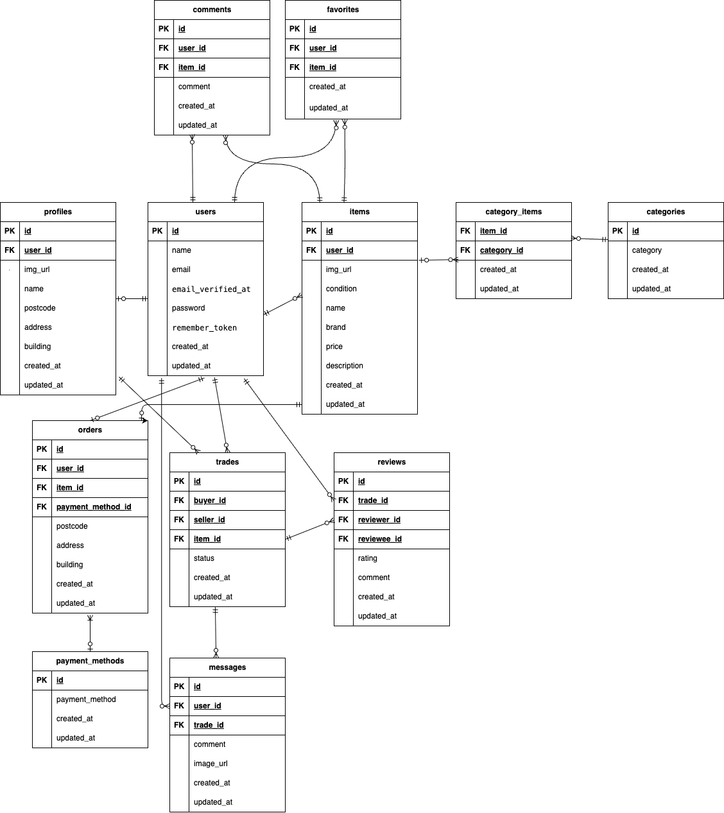

# market-form

## 環境構築

### Docker ビルド
1. git clone https://github.com/irokiyo/market-form.git market-clone  
1. cd market-clone  
1. docker-compose up -d --build  

### Laravel 環境構築

1. docker-compose exec php bash  
1. composer install  
1. cd src  
1. cp .env.example .env  
1. .env ファイルの一部を以下のように編集
```
DB_CONNECTION=mysql
DB_HOST=mysql
DB_PORT=3306
DB_DATABASE=laravel_db
DB_USERNAME=laravel_user
DB_PASSWORD=laravel_pass
```
6. docker-compose exec php bash  
1. php artisan key:generate  
1. php artisan migrate:fresh  
1. php artisan db:seed  
1. php artisan storage:link  

## メール認証(MailHog)
メール認証と購入者のレビュー登録の際に使用しています  

### MailHog 環境構築  

1. .envに以下を追加する
```
MAIL_MAILER=smtp
MAIL_HOST=mailhog
MAIL_PORT=1025
MAIL_USERNAME=null
MAIL_PASSWORD=null
MAIL_ENCRYPTION=null
MAIL_FROM_ADDRESS=test@example.com
MAIL_FROM_NAME="${APP_NAME}"
```
1. docker-compose down
1. docker-compose up -d
1. docker-compose exec php bash
1. php artisan config:clear

## 決済（Stripe）
決済機能は Stripe を使用しています。  
支払い方法のカード支払いのみstripeの画面に遷移するように作成しています。  

### Stripe 環境構築
1. docker-compose exec php bash
1. composer require stripe/stripe-php  
1. .env ファイルに以下を追加する  
```
STRIPE_KEY=pk_test_xxxxxxxxxxxxx  
STRIPE_SECRET=sk_test_xxxxxxxxxxxxx  
STRIPE_WEBHOOK_SECRET=whsec_xxxxxxxxxxxxx  
```  
※ 値はStripe (https://dashboard.stripe.com/)  ダッシュボードから取得しています。  
Webhook を利用していますので
ローカルでは Stripe CLI を使用しています。  
1. stripe login
1. stripe listen --forward-to http://localhost/stripe/webhook
1. 表示された whsec_... を .env の STRIPE_WEBHOOK_SECRET に設定しています


## user のログイン用初期データ  

- メールアドレス: yamada@example.com  
- パスワード: password  
- CO01~CO05のダミーデータを出品  

- メールアドレス: sato@example.com  
- パスワード: password  
- CO06~CO010のダミーデータを出品  

- メールアドレス: suzuki@example.com  
- パスワード: password

## 使用技術
- MySQL 8.0.26  
- Laravel: 8.83.3  
- PHP 8.1 (Docker)  
- MailHog (ローカル開発用)  
- Stripe（決済）  

## テスト・品質管理
- PHPUnit（Feature Test）
- PHPStan（静的解析）
- PHPCS（コーディング規約チェック）
- GitHub Actions（CI）

## URL
- 環境開発: http://localhost/  
- phpMyAdmin: http://localhost:8080/  
- MailHog: http://localhost:8025/  
- Stripe: https://dashboard.stripe.com/  


## ER 図


## 追加機能
購入者と出品者のやり取りができるチャット機能と評価機能を追加しました。
追加テーブルは以下の通りです。
tradesテーブル（取引テーブル）
| カラム名           |  型          |primary key  |unique key  |not null  |foreign key  |
| ------------------| ------------|-------------|------------|----------|-------------|
| id                | bigint      |⚪︎           |             |⚪︎        |             |
|buyer_id　　        |bigint       |             |            |⚪︎       |user(id)      |
|seller_id          |bigint       |             |             |⚪︎       |user(id)     |
|item_id            |bigint       |             |             |⚪︎       |item(id)     |
|status             |varchar(255) |             |             |⚪︎       |             |
|buyer_completed_at |timestamp    |             |             |         |             |
|seller_reviewed_at |timestamp    |             |             |         |             |
|created_at         |timestamp    |             |             |         |             |
|updated_at         |timestamp    |             |             |         |             |

messagesテーブル（メッセージテーブル）
| カラム名   |  型          |primary key  |unique key  |not null  |foreign key  |
| --------- | ------------|-------------|------------|----------|-------------|
| id        | bigint      |⚪︎           |             |⚪︎        |             |
|user_id　　|bigint        |             |            |⚪︎        |user(id)     |
|receiver_id|bigint       |             |            |⚪︎        |user(id)     |
|trade_id　 |bigint       |             |             |⚪︎        |trade(id)    |
|comment    |varchar(255) |             |             |⚪︎       |             |
|image_url  |varchar(255) |             |             |         |             |
|read       |boolean      |             |             |         |             |
|created_at |timestamp    |             |             |         |             |
|updated_at |timestamp    |             |             |         |             |

reviewsテーブル（評価テーブル）
| カラム名           |  型          |primary key  |unique key  |not null  |foreign key  |
| ------------------| ------------|-------------|-------------|----------|-------------|
| id                | bigint      |⚪︎           |             |⚪︎        |             |
|reviewer_id        |bigint       |             |             |⚪︎        |user(id)     |
|reviewee_id        |bigint       |             |             |⚪︎        |user(id)     |
|trade_id　         |bigint       |             |             |⚪︎        |trade(id)    |
|rating             |int          |             |             |⚪︎       |             |
|comment            |varchar(255) |             |             |         |             |
|created_at         |timestamp    |             |             |         |             |
|updated_at         |timestamp    |             |             |         |             |